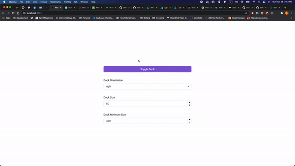

# React Use Dock

## A hook to render dynamic content into a Dock!

[Visit Demo](https://react-use-dock.vercel.app/)

<p align="center">
  
</p>

## Install

(requires React version ^16.8.0)

```bash
# npm
npm i react-use-dock

# Yarn
yarn add react-use-dock
```

## Usage

> ### Wrap application with `DockProvider`

```jsx
import { DockProvider } from 'react-use-dock'

function MyApp() {
  return (
    <DockProvider>
      <Layout>
        <AppContent />
      </Layout>
    </DockProvider>
  )
}
```

> ### Add `Dock` component into your component tree

```jsx
import { Dock } from 'react-use-dock'

function Layout({ children }) {
  return (
    <div>
      <header>
        <h1>React Use Dock</h1>
      </header>

      <main>{children}</main>

      <footer>Stuff</footer>

      {/* Dock is absolutely positioned, place anywhere */}
      <Dock />
    </div>
  )
}
```

> ### Use Dock

```jsx
import { useEffect } from 'react'
import { useDock, DockContainer } from 'react-use-dock'

function Example() {
  const dock = useDock()

  // provide any render function!
  const render = () => (
    <DockContainer onCloseDock={() => console.log('Closed dock')}>
      <YourDockContent />
    </DockContainer>
  )

  useEffect(() => {
    dock.renderDock({
      render,
      isOpen: true,
      minSize: 350,
      orientation: 'right',
      size: 50,
    })
  }, [])

  return (
    <div>
      <button onClick={dock.toggleDock}>Toggle Dock</button>
    </div>
  )
}
```

## API

> ### Types

```jsx
interface RenderDockOptions {
  isOpen: boolean
  size: number
  minSize: number
  orientation: Orientation
  render(): JSX.Element | null
}

type Orientation = 'top' | 'bottom' | 'left' | 'right'
```

> ### State

| Name        | Type                        | Description                                                                                                          | Default    |
| ----------- | --------------------------- | -------------------------------------------------------------------------------------------------------------------- | ---------- |
| render      | `() => JSX.Element \| null` | Render function for Dock content                                                                                     | () => null |
| isOpen      | `boolean`                   | Is dock open                                                                                                         | false      |
| size        | `number`                    | Dock size converted to css unit `vw` if orientation is `left` or `right` OR `vh` if orientation is `top` or `bottom` | 50         |
| minSize     | `number`                    | Dock minimum size converted to css unit `px`                                                                         | 350        |
| orientation | `Orientation`               | Side of viewport Dock is positioned                                                                                  | right      |

> ### Functions

| Name           | Signature                                  | Description                                                     |
| -------------- | ------------------------------------------ | --------------------------------------------------------------- |
| openDock       | `openDock()`                               | Open the Dock                                                   |
| closeDock      | `closeDock()`                              | Close the Dock                                                  |
| toggleDock     | `toggleDock()`                             | Toggle Dock between open and closed depending on current state. |
| renderDock     | `renderDock(options: RenderDockOptions)`   | Configure Dock state and optionally open the Dock               |
| setOrientation | `setOrientation(orientation: Orientation)` | Set Dock orientation                                            |
| setSize        | `setSize(size:number)`                     | Set Dock size                                                   |
| setMinSize     | `setMinSize(minSize:number)`               | Set Dock minimum size                                           |

> ### DockContainer

The `DockContainer` component is a simple wrapper component that renders a close icon at the top right.

```jsx
interface DockContainerProps {
  children: any
  onCloseDock?(): void
  CloseIcon?: ReactNode // renders <span style={{ fontSize: '1.5em' }}>&times;</span> by default
}
```

```jsx
import { DockContainer } from 'react-use-dock'

function Example() {
  return (
    <DockContainer
      onCloseDock={() => console.log('Closed Dock')}
      CloseIcon={<span>Close Dock</span>}
    >
      <YourDockContent />
    </DockContainer>
  )
}
```
